# Object-Relational Mapping (ORM): E-Commerce Back End

## Task
---
To build the back end for an e-commerce site by modifying starter code. You’ll configure a working Express.js API to use Sequelize to interact with a MySQL database.
## Functionality
---

Creating database in MYSQL
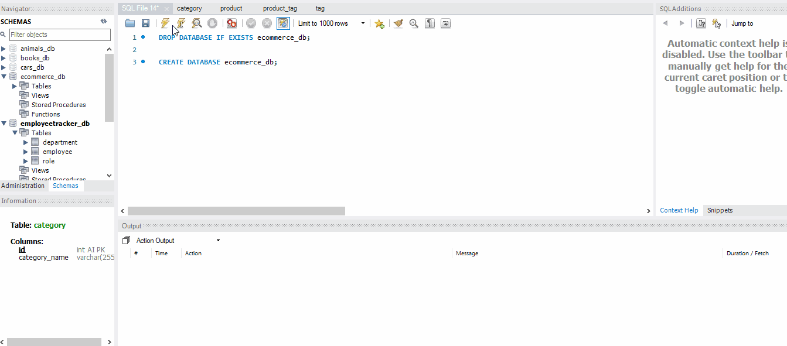

NPM run seed
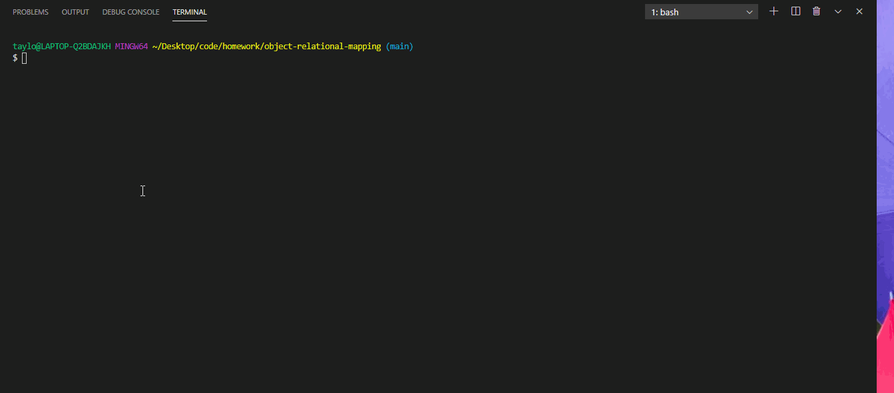

NPM run start
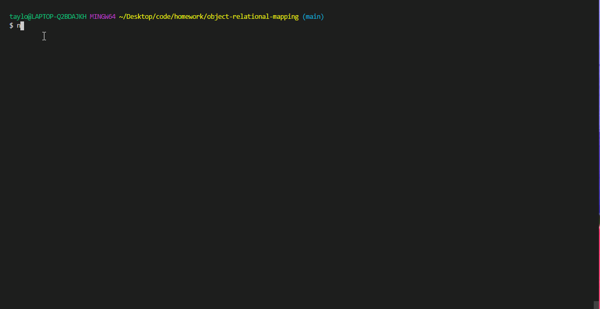

GET ALL categories, products and tags
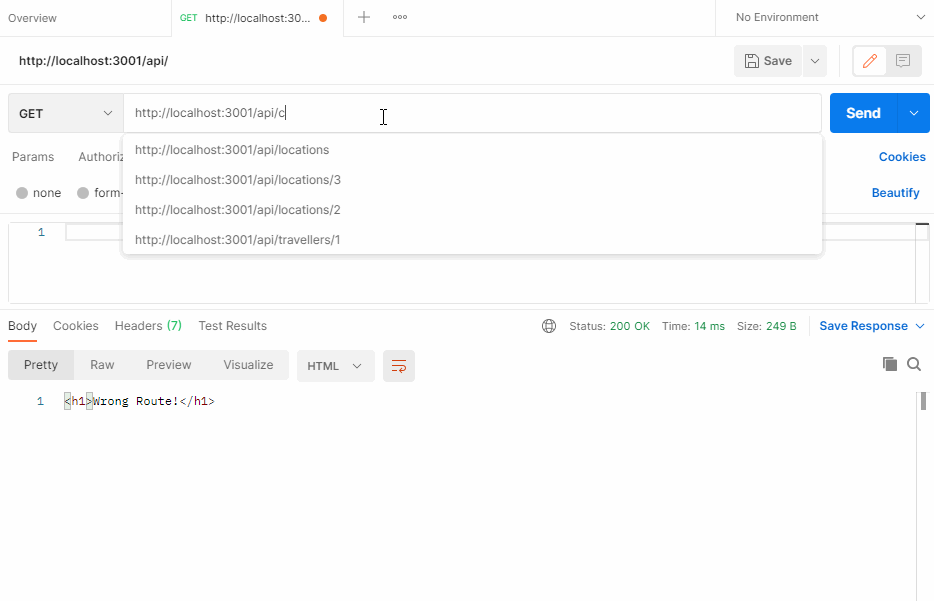

GET categories by ID, products by ID and tags by ID
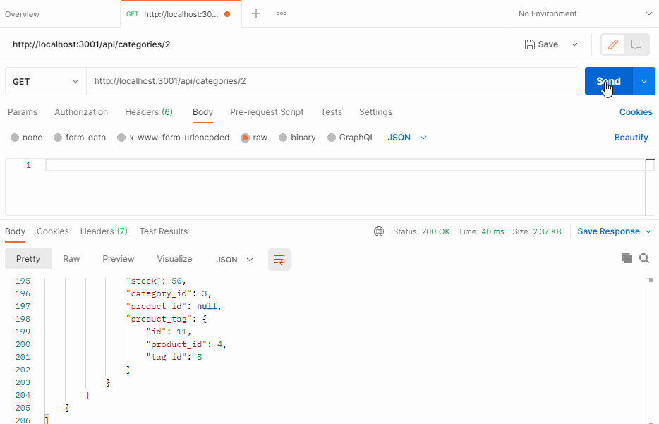

POST product
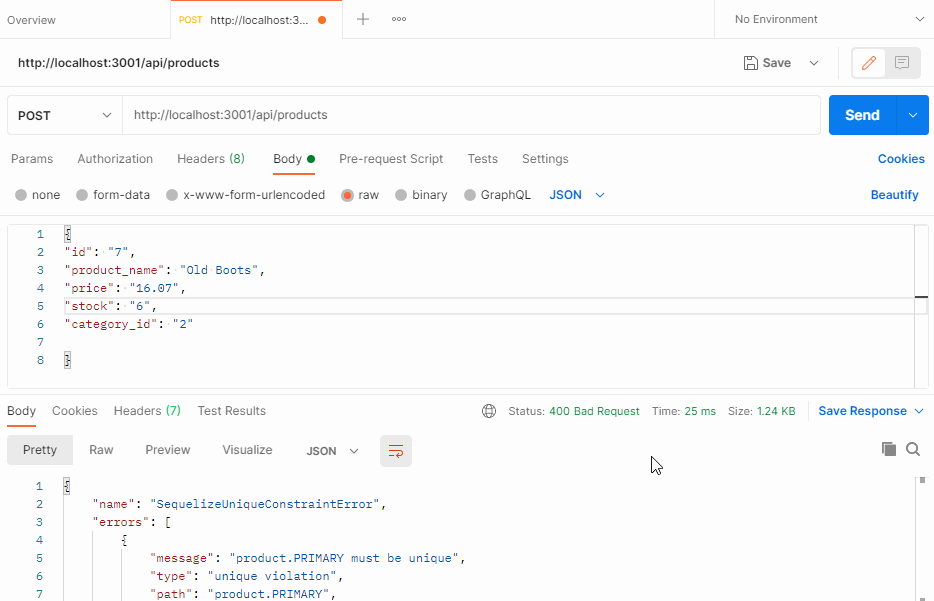

POST category
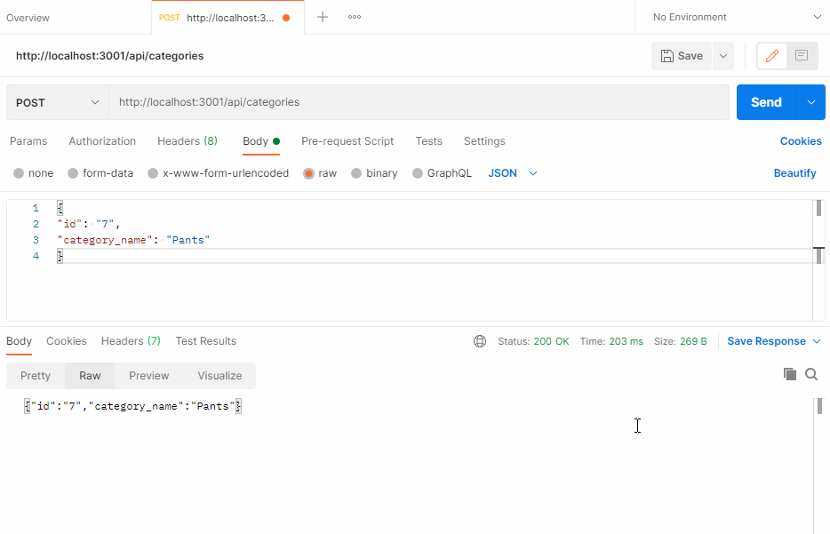

POST tags
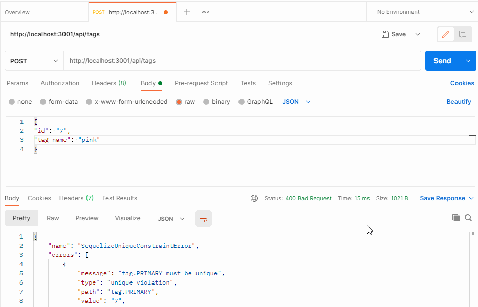

DELETE tags by ID
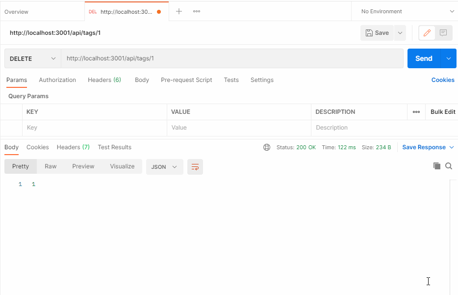

DELETE prodcuts by ID
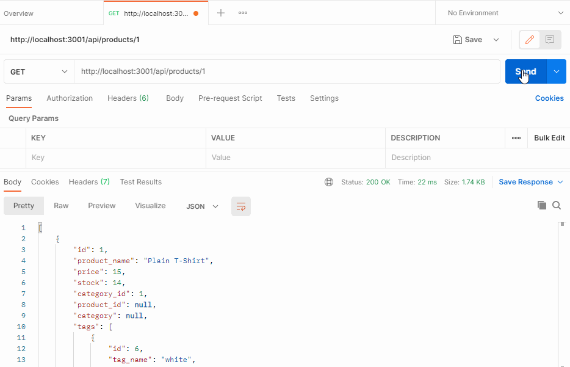

DELETE categories by ID
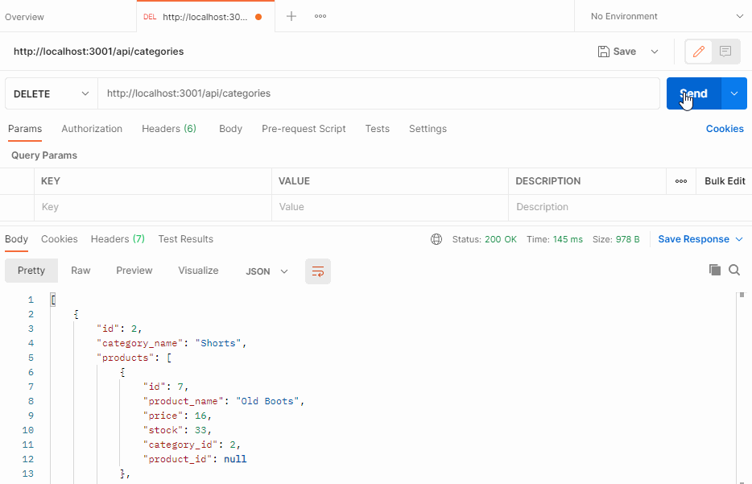

## Deployment
---
The URL of the [deployed](https://tweeks07.github.io/Team-Generator/) application

The URL of the GitHub [repository](https://github.com/tweeks07/object-relational-mapping)

## Contact Information
---
Taylor Weeks

Email: taylorlweeks707@gmail.com

[Github](https://github.com/tweeks07)
---
© 2021 Trilogy Education Services, LLC, a 2U, Inc. brand. Confidential and Proprietary. All Rights Reserved.